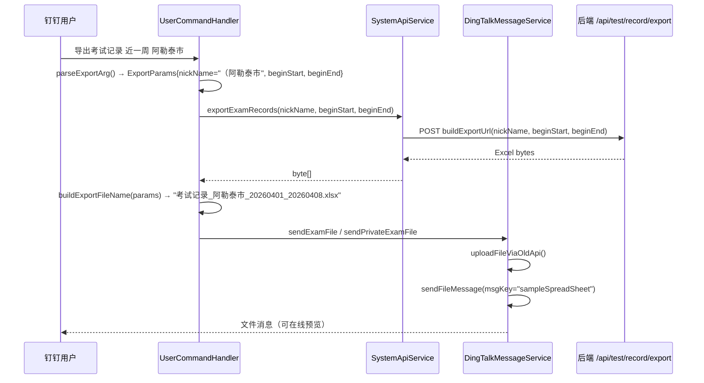

# 技术设计文档：exam-export-filter

## 概述

本次变更为钉钉机器人"导出考试记录"功能新增筛选能力，在不破坏现有全量导出逻辑的前提下，扩展支持：

- 按区域筛选（近一周 / 近一个月 / 自定义时间段）
- 按学生姓名筛选（全量时间段）

筛选逻辑复用现有导出接口 `/api/test/record/export`，通过 `nickName` 参数实现后端模糊匹配：
- 区域筛选：传入 `（<区域名>` 作为 nickName 前缀（利用后端 nickName 格式 `姓名（区域）` 的特点）
- 学生筛选：传入学生姓名，beginStart/beginEnd 传空字符串

同时将文件消息类型从 `sampleFile` 改为 `sampleSpreadSheet`，使 Excel 文件在钉钉内可在线预览。

涉及修改的文件：
- `UserCommandHandler.java` — 指令解析与路由
- `SystemApiService.java` — 导出 URL 构建
- `DingTalkMessageService.java` — 消息发送类型

---

## 架构

整体调用链不变，仅在各层内部扩展参数传递：



---

## 组件与接口

### UserCommandHandler

#### 新增内部结构 `ExportParams`

```java
/** 导出指令解析结果 */
private static class ExportParams {
    /** nickName 筛选值：区域前缀（"（<区域名>"）或学生姓名，null 表示不筛选 */
    String nickName;
    /** 开始时间，格式 yyyy-MM-dd HH:mm:ss；学生模式下为 null */
    String beginStart;
    /** 结束时间，格式 yyyy-MM-dd HH:mm:ss；学生模式下为 null */
    String beginEnd;
    /** 用于文件名的可读标签（区域名或学生姓名） */
    String label;
    /** 筛选模式：REGION（按区域）、STUDENT（按学生）、ALL（全量，兼容旧逻辑） */
    ExportMode mode;
}

enum ExportMode { ALL, REGION, STUDENT }
```

#### 扩展 `parseExportArg(String arg)` — 替换现有 `parseTimeRange` 调用

新方法签名：`private ExportParams parseExportArg(String arg)`

解析规则（按优先级匹配）：

| 输入格式 | mode | nickName | beginStart/beginEnd |
|---|---|---|---|
| `近一周 <区域名>` | REGION | `（<区域名>` | 近7天 |
| `近一个月 <区域名>` | REGION | `（<区域名>` | 近1个月 |
| `<日期> <日期> <区域名>` | REGION | `（<区域名>` | 自定义 |
| `学生 <学生姓名>` | STUDENT | `<学生姓名>` | null / null |
| `近一周`（无区域名，兼容旧格式） | ALL | null | 近7天 |
| `近一个月`（无区域名） | ALL | null | 近1个月 |
| `<日期> <日期>`（无区域名） | ALL | null | 自定义 |

解析逻辑：
1. 检测是否以 `学生 ` 开头 → STUDENT 模式
2. 检测是否包含 `近一周` / `近一个月` → 提取关键词后的剩余部分作为区域名
3. 尝试解析前两个 token 为日期 → 第三个 token（若存在）为区域名
4. 区域名非空 → REGION 模式；否则 → ALL 模式（兼容旧逻辑）

#### 修改 `handleExportExam`

```java
private void handleExportExam(String arg, ...) {
    ExportParams params = parseExportArg(arg);
    if (params == null) {
        reply(..., buildExportErrorHint());
        return;
    }
    // 构建提示消息
    reply(..., "正在导出考试记录（" + buildProgressLabel(params) + "），请稍候...");

    asyncExecutor.submit(() -> {
        byte[] fileData = systemApiService.exportExamRecords(
            params.nickName,
            params.beginStart != null ? params.beginStart : "",
            params.beginEnd   != null ? params.beginEnd   : ""
        );
        // ... 错误处理不变 ...
        fileData = ExcelService.addRegionColumn(fileData);
        String fileName = buildExportFileName(params);
        replyFile(..., fileName, fileData);
    });
}
```

#### 修改 `buildExportFileName`

```java
private String buildExportFileName(ExportParams params) {
    switch (params.mode) {
        case STUDENT:
            return "考试记录_" + params.label + ".xlsx";
        case REGION:
            String begin = formatFileDate(params.beginStart);
            String end   = formatFileDate(params.beginEnd);
            return "考试记录_" + params.label + "_" + begin + "_" + end + ".xlsx";
        default: // ALL — 兼容旧逻辑
            String b = formatFileDate(params.beginStart);
            String e = formatFileDate(params.beginEnd);
            return "考试记录_" + b + "_" + e + ".xlsx";
    }
}
```

#### 修改 `buildHelpText` 和错误提示

帮助文本新增四种格式：
```
导出考试记录 近一周 <区域名>
导出考试记录 近一个月 <区域名>
导出考试记录 2026-04-01 2026-04-11 <区域名>
导出考试记录 学生 <学生姓名>
```

---

### SystemApiService

#### 新增重载 `exportExamRecords(String nickName, String beginStart, String beginEnd)`

```java
/**
 * 下载考试记录 Excel，支持按 nickName 筛选。
 *
 * @param nickName   筛选值：区域前缀（"（<区域名>"）或学生姓名；空字符串表示不筛选
 * @param beginStart 开始时间 yyyy-MM-dd HH:mm:ss；空字符串表示不限制
 * @param beginEnd   结束时间 yyyy-MM-dd HH:mm:ss；空字符串表示不限制
 */
public byte[] exportExamRecords(String nickName, String beginStart, String beginEnd)
```

原有无参重载保持兼容：
```java
public byte[] exportExamRecords(String beginStart, String beginEnd) {
    return exportExamRecords("", beginStart, beginEnd);
}
```

#### 修改 `buildExportUrl`

```java
private String buildExportUrl(String nickName, String beginStart, String beginEnd) {
    String encodedNickName = (nickName == null || nickName.isBlank())
        ? ""
        : URLEncoder.encode(nickName, StandardCharsets.UTF_8);
    String encodedBegin = (beginStart == null || beginStart.isBlank())
        ? ""
        : URLEncoder.encode(beginStart, StandardCharsets.UTF_8);
    String encodedEnd = (beginEnd == null || beginEnd.isBlank())
        ? ""
        : URLEncoder.encode(beginEnd, StandardCharsets.UTF_8);

    return BASE_URL + "/test/record/export"
        + "?nickName=" + encodedNickName
        + "&phone=&pageSize=10000&pageNum=1"
        + "&beginStart=" + encodedBegin
        + "&beginEnd=" + encodedEnd;
}
```

---

### DingTalkMessageService

将 `sendFileMessage` 和 `sendPrivateFileMessage` 中的 `msgKey` 从 `"sampleFile"` 改为 `"sampleSpreadSheet"`，msgParam 结构（fileName + mediaId）不变。

```java
// sendFileMessage 中
body.put("msgKey", "sampleSpreadSheet");  // 原为 "sampleFile"

// sendPrivateFileMessage 中
body.put("msgKey", "sampleSpreadSheet");  // 原为 "sampleFile"
```

---

## 数据模型

### ExportParams（内部 DTO）

| 字段 | 类型 | 说明 |
|---|---|---|
| `mode` | `ExportMode` | ALL / REGION / STUDENT |
| `nickName` | `String` | URL nickName 参数值；null 或空字符串表示不筛选 |
| `label` | `String` | 文件名中的可读标签（区域名或学生姓名） |
| `beginStart` | `String` | `yyyy-MM-dd HH:mm:ss`；STUDENT 模式下为 null |
| `beginEnd` | `String` | `yyyy-MM-dd HH:mm:ss`；STUDENT 模式下为 null |

### 导出 URL 参数映射

| 场景 | nickName | beginStart | beginEnd |
|---|---|---|---|
| 全量（旧逻辑） | `""` | `"2026-04-01 00:00:00"` | `"2026-04-08 23:59:59"` |
| 按区域 | `"（阿勒泰市"` | `"2026-04-01 00:00:00"` | `"2026-04-08 23:59:59"` |
| 按学生 | `"张三"` | `""` | `""` |

---

## 正确性属性

*属性（Property）是在系统所有合法执行中都应成立的行为特征，是人类可读规范与机器可验证正确性保证之间的桥梁。*

### 属性 1：区域解析 — nickName 前缀正确性

*对于任意* 非空区域名字符串 `region`，以及任意合法时间关键词（`近一周` / `近一个月`）或合法日期对，调用 `parseExportArg` 后，返回的 `nickName` 应等于 `"（" + region`，`mode` 应为 `REGION`。

**验证：需求 1.1、2.1、3.1**

### 属性 2：学生解析 — nickName 与时间参数正确性

*对于任意* 非空学生姓名字符串 `name`，调用 `parseExportArg("学生 " + name)` 后，返回的 `nickName` 应等于 `name`，`beginStart` 和 `beginEnd` 均应为 null 或空字符串，`mode` 应为 `STUDENT`。

**验证：需求 4.1**

### 属性 3：URL 构建 — nickName 编码 round-trip

*对于任意* 字符串 `nickName`（包含中文、特殊字符、空字符串），调用 `buildExportUrl(nickName, beginStart, beginEnd)` 后，从生成的 URL 中提取 `nickName` 参数并进行 URL 解码，结果应等于原始 `nickName`（空字符串时解码结果仍为空字符串）。

**验证：需求 5.2、5.3**

### 属性 4：文件名生成 — 区域模式格式正确性

*对于任意* 非空区域名 `region` 和合法日期对 `(begin, end)`，`buildExportFileName` 在 REGION 模式下生成的文件名应满足格式 `考试记录_<region>_<yyyyMMdd>_<yyyyMMdd>.xlsx`，且两个日期部分分别对应 `begin` 和 `end`。

**验证：需求 1.3、2.3、3.3**

### 属性 5：文件名生成 — 学生模式格式正确性

*对于任意* 非空学生姓名 `name`，`buildExportFileName` 在 STUDENT 模式下生成的文件名应满足格式 `考试记录_<name>.xlsx`。

**验证：需求 4.3**

---

## 错误处理

| 场景 | 处理方式 |
|---|---|
| 区域名为空（如 `导出考试记录 近一周`，末尾无区域名） | `parseExportArg` 返回 ALL 模式（兼容旧逻辑），不报错 |
| 区域名显式为空（如 `导出考试记录 近一周 `，末尾有空格） | trim 后等同于无区域名，走 ALL 模式 |
| 学生姓名为空（`导出考试记录 学生`） | `parseExportArg` 返回 null，回复格式错误提示 |
| 日期格式非法 | `DateTimeParseException` 捕获，`parseExportArg` 返回 null，回复格式错误提示 |
| 导出接口返回空数据 | 现有逻辑不变，回复"服务端未返回文件数据" |
| 导出接口返回 JSON 错误（token 失效） | 现有 token 重试逻辑不变 |
| 文件上传成功但消息发送失败 | 现有逻辑不变，记录 error 日志 |

---

## 测试策略

### 单元测试（example-based）

**UserCommandHandler**
- `parseExportArg("近一周 阿勒泰市")` → mode=REGION, nickName="（阿勒泰市", beginStart 为7天前
- `parseExportArg("近一个月 乌鲁木齐")` → mode=REGION, nickName="（乌鲁木齐"
- `parseExportArg("2026-04-01 2026-04-11 昌吉市")` → mode=REGION, nickName="（昌吉市"
- `parseExportArg("学生 张三")` → mode=STUDENT, nickName="张三", beginStart=null
- `parseExportArg("学生 ")` → null（学生姓名为空）
- `parseExportArg("近一周")` → mode=ALL（兼容旧逻辑）
- `buildHelpText()` 包含四种新格式字符串
- 格式错误提示包含所有支持格式

**SystemApiService**
- `buildExportUrl("（阿勒泰市", "2026-04-01 00:00:00", "2026-04-08 23:59:59")` → URL 包含编码后的 nickName
- `buildExportUrl("", "2026-04-01 00:00:00", "2026-04-08 23:59:59")` → nickName 参数为空字符串
- `buildExportUrl("张三", "", "")` → beginStart/beginEnd 参数为空字符串

**DingTalkMessageService**
- `sendFileMessage` 发送的 JSON body 中 `msgKey == "sampleSpreadSheet"`
- `sendPrivateFileMessage` 发送的 JSON body 中 `msgKey == "sampleSpreadSheet"`

### 属性测试（property-based）

使用 [jqwik](https://jqwik.net/)（Java 属性测试库），每个属性最少运行 100 次。

每个属性测试用注释标注对应设计属性：
```
// Feature: exam-export-filter, Property N: <属性描述>
```

**属性 1 — 区域解析 nickName 前缀正确性**
- 生成器：随机非空字符串作为区域名，随机选择时间关键词或合法日期对
- 断言：`params.nickName.equals("（" + region)` && `params.mode == REGION`

**属性 2 — 学生解析正确性**
- 生成器：随机非空字符串作为学生姓名
- 断言：`params.nickName.equals(name)` && `params.beginStart == null || params.beginStart.isEmpty()`

**属性 3 — URL nickName 编码 round-trip**
- 生成器：随机字符串（含中文、特殊字符、空字符串）
- 断言：`URLDecoder.decode(extractParam(url, "nickName")) == nickName`

**属性 4 — 区域文件名格式**
- 生成器：随机非空区域名，随机合法日期对
- 断言：文件名匹配正则 `考试记录_.+_\d{8}_\d{8}\.xlsx`，且包含区域名和日期

**属性 5 — 学生文件名格式**
- 生成器：随机非空学生姓名
- 断言：文件名匹配 `考试记录_<name>.xlsx`
