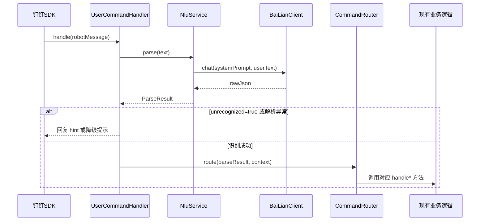

# 技术设计文档：自然语言指令（natural-language-command）

## 概述

本功能在现有钉钉机器人指令处理链路中插入一个自然语言理解（NLU）层。用户发送的自然语言消息经百炼大模型（通义千问 qwen-plus）解析后，转换为结构化的 `ParseResult`，再由 `CommandRouter` 路由到现有的指令处理逻辑执行。整个改造对现有 `UserCommandHandler` 的核心业务逻辑零侵入，仅在消息入口处增加一个解析前置步骤。

### 设计目标

- 用户无需记忆严格指令格式，自然语言描述即可触发操作
- NLU 层故障时系统可优雅降级，不中断现有服务
- 新增代码与现有代码解耦，便于独立测试和维护

---

## 架构

### 消息处理流程



### 组件关系

```
UserCommandHandler
  └── NluService          ← 新增：意图解析
        └── BaiLianClient ← 新增：百炼 HTTP 客户端
  └── CommandRouter       ← 新增：意图路由（提取自现有 handle() 中的 if-else 逻辑）
        └── 现有 handle* 方法（handleBatchCreate / handleSearch / handleExportExam / handleStudentStats）
```

---

## 组件与接口

### BaiLianClient

封装对阿里百炼 OpenAI 兼容接口的调用，复用 `BaiLianTest.java` 中已验证的 SDK 用法。

```java
public class BaiLianClient {
    // 从 -Dbailian.apiKey=xxx 读取
    private final OpenAIClient openAIClient;

    public BaiLianClient();  // 构造时读取 apiKey，未配置则抛 IllegalStateException

    /**
     * 发送单轮对话请求。
     * @param systemPrompt 系统提示词
     * @param userMessage  用户消息
     * @return 模型返回的原始文本
     * @throws RuntimeException 网络异常或超时时抛出
     */
    public String chat(String systemPrompt, String userMessage);
}
```

**关键配置：**
- SDK：`com.openai:openai-java:2.6.0`（与现有 `BaiLianTest.java` 一致）
- baseUrl：`https://dashscope.aliyuncs.com/compatible-mode/v1`
- model：`qwen-plus`
- apiKey：`System.getProperty("bailian.apiKey")`

### NluService

负责调用 `BaiLianClient`，清洗模型输出，解析为 `ParseResult`。

```java
public class NluService {
    private final BaiLianClient baiLianClient;

    public NluService(BaiLianClient baiLianClient);

    /**
     * 解析用户自然语言消息为结构化指令。
     * @param userText 用户消息文本
     * @return ParseResult，永不返回 null；解析失败时返回 unrecognized=true 的结果
     */
    public ParseResult parse(String userText);

    /** 去除模型返回中可能存在的 Markdown 代码块标记 */
    static String stripMarkdownCodeBlock(String raw);
}
```

### ParseResult

NLU 解析结果的数据模型。

```java
public class ParseResult {
    private String intent;           // 意图名称，如 "CREATE_USER"
    private Map<String, Object> params; // 参数键值对
    private boolean unrecognized;    // true 表示无法识别
    private String hint;             // unrecognized=true 时给用户的提示

    // getters / setters / 静态工厂方法
    public static ParseResult ofUnrecognized(String hint);
}
```

### CommandRouter

从 `UserCommandHandler.handle()` 中提取路由逻辑，根据 `ParseResult.intent` 分发到对应的 `handle*` 方法。

```java
public class CommandRouter {
    // 合法意图集合
    public static final Set<String> VALID_INTENTS = Set.of(
        "CREATE_USER", "SEARCH_USER", "EXPORT_EXAM", "STUDENT_STATS", "HELP"
    );

    /**
     * 根据 ParseResult 路由到对应处理逻辑。
     * @param result          NLU 解析结果
     * @param conversationType 会话类型（"1"=私聊，"2"=群聊）
     * @param conversationId  会话 ID
     * @param senderId        发送者 ID（私聊时使用）
     */
    public void route(ParseResult result,
                      String conversationType, String conversationId, String senderId);
}
```

### UserCommandHandler（改造）

在现有 `handle()` 方法入口处增加 NLU 解析步骤，原有 if-else 路由逻辑迁移到 `CommandRouter`。

```java
// 改造后的 handle() 核心流程（伪代码）
public void handle(String robotMessage) {
    // ... 现有的消息解析、授权检查逻辑不变 ...

    // 新增：NLU 解析
    if (nluService != null) {
        try {
            ParseResult result = nluService.parse(text);
            if (result.isUnrecognized()) {
                reply(..., result.getHint());
                return;
            }
            commandRouter.route(result, conversationType, conversationId, senderId);
        } catch (Exception e) {
            log.error("NLU 解析异常", e);
            reply(..., "自然语言解析服务暂时不可用，请使用标准指令格式\n" + buildHelpText());
        }
    } else {
        // NLU 未启用，回退到原有 if-else 路由（或直接提示）
        reply(..., "NLU 功能未启用，请使用标准指令格式\n" + buildHelpText());
    }
}
```

---

## 数据模型

### ParseResult JSON 格式

**识别成功：**
```json
{
  "intent": "CREATE_USER",
  "params": {
    "users": "张三 13800138000,李四 13900139000"
  }
}
```

**无法识别：**
```json
{
  "unrecognized": true,
  "hint": "您想创建用户，但缺少手机号，请补充：创建用户 张三 13800138000"
}
```

### 意图与参数映射表

| intent | 必填 params | 可选 params | 对应现有方法 |
|--------|------------|------------|------------|
| `CREATE_USER` | `users`（格式：`姓名 手机号[,姓名 手机号]`） | — | `handleBatchCreate` |
| `SEARCH_USER` | `nickName` | — | `handleSearch` |
| `EXPORT_EXAM` | `timeRange`（近一周/近一个月/`yyyy-MM-dd yyyy-MM-dd`） | `region`, `studentName` | `handleExportExam` |
| `STUDENT_STATS` | `timeRange` | — | `handleStudentStats` |
| `HELP` | — | — | 回复 `buildHelpText()` |

### System Prompt 设计

System Prompt 以中文编写，包含以下内容：

1. **角色定义**：你是一个钉钉机器人指令解析助手，负责将用户的自然语言消息转换为结构化 JSON 指令。
2. **支持的指令列表**：详细描述五类指令的格式和参数。
3. **输出格式约束**：
   - 仅输出纯 JSON，不包含任何 Markdown 代码块标记（如 ` ```json ` ）
   - 识别成功：`{"intent": "<指令名>", "params": {<参数键值对>}}`
   - 无法识别：`{"unrecognized": true, "hint": "<给用户的中文提示>"}`
4. **模糊处理**：当用户消息缺少必要参数时，在 `hint` 中明确告知缺少哪些信息。

---

## 正确性属性

*属性（Property）是在系统所有合法执行中都应成立的特征或行为——本质上是对系统应做什么的形式化陈述。属性是人类可读规范与机器可验证正确性保证之间的桥梁。*

### 属性 1：合法 ParseResult 的序列化往返

*对于任意* 合法的 `ParseResult` 对象（intent 属于合法集合或 unrecognized=true），将其序列化为 JSON 字符串后再反序列化，应得到语义等价的对象。

**验证：需求 6.2**

### 属性 2：Markdown 标记清洗的等价性

*对于任意* 合法的 JSON 字符串，在其前后添加 Markdown 代码块标记（` ```json ` 和 ` ``` `）后，经 `NluService.stripMarkdownCodeBlock()` 清洗，再解析得到的 `ParseResult` 应与不含标记时的解析结果语义等价。

**验证：需求 3.6、6.3**

### 属性 3：解析结果的意图合法性

*对于任意* 输入字符串（合法 JSON 或非法内容），`NluService.parse()` 的返回值要么满足 `intent ∈ {CREATE_USER, SEARCH_USER, EXPORT_EXAM, STUDENT_STATS, HELP}`，要么 `unrecognized=true`，不存在第三种状态。

**验证：需求 1.4、6.1**

### 属性 4：非法 JSON 输入视为 unrecognized

*对于任意* 无法解析为合法 JSON 的字符串，`NluService` 的解析结果应为 `unrecognized=true`，且 `hint` 字段非空。

**验证：需求 5.2**

---

## 错误处理

| 场景 | 处理方式 |
|------|---------|
| `bailian.apiKey` 未配置 | `BaiLianClient` 构造时抛 `IllegalStateException`；`UserCommandHandler` 初始化时捕获，将 `nluService` 置为 `null`，收到消息时回复"NLU 功能未启用"提示 |
| 百炼接口网络异常/超时 | `BaiLianClient.chat()` 抛运行时异常；`UserCommandHandler.handle()` 捕获，回复"自然语言解析服务暂时不可用"及帮助文本 |
| 模型返回非法 JSON | `NluService.parse()` 捕获解析异常，返回 `unrecognized=true`，hint 为原始返回内容 |
| 模型返回未知 intent | `CommandRouter.route()` 检测到 intent 不在合法集合中，回复帮助文本，记录 warn 日志 |
| 模型返回含 Markdown 标记 | `NluService.stripMarkdownCodeBlock()` 清洗后再解析，提高鲁棒性 |

---

## 测试策略

### 单元测试（示例测试）

针对固定行为和边界条件：

- `BaiLianClientTest`：apiKey 未配置时抛 `IllegalStateException`
- `NluServiceTest`：
  - 合法 JSON 解析为正确 ParseResult
  - 非法 JSON 返回 unrecognized=true
  - 含 Markdown 标记的 JSON 清洗后正确解析
- `CommandRouterTest`：
  - 五类 intent 各自路由到正确的 handle* 方法（mock 验证）
  - 未知 intent 回复帮助文本
- `UserCommandHandlerTest`：
  - NLU 异常时回复降级提示
  - unrecognized=true 时回复 hint 内容
  - apiKey 未配置时回复"NLU 功能未启用"

### 属性测试（Property-Based Testing）

使用 **jqwik**（Java 属性测试库）实现，每个属性测试最少运行 **100 次**迭代。

每个属性测试用注释标注对应设计属性：
```
// Feature: natural-language-command, Property N: <属性描述>
```

**属性 1 实现思路**：生成随机合法 `ParseResult`（随机 intent + 随机 params，或随机 hint），序列化为 JSON 再反序列化，断言字段值相等。

**属性 2 实现思路**：生成随机合法 JSON 字符串，分别测试原始版本和包裹 Markdown 标记的版本，断言 `stripMarkdownCodeBlock` 后两者解析结果相同。

**属性 3 实现思路**：生成随机字符串（包含合法 JSON 和随机字符串），调用 `NluService` 的 JSON 解析逻辑，断言结果满足意图合法性约束。

**属性 4 实现思路**：生成随机非 JSON 字符串（排除合法 JSON），断言解析结果 `unrecognized=true` 且 `hint` 非空。

### 集成测试

- 使用真实 `bailian.apiKey` 对 `NluService` 进行端到端测试（CI 中跳过，本地手动运行）
- 验证典型自然语言输入能正确映射到对应 intent
